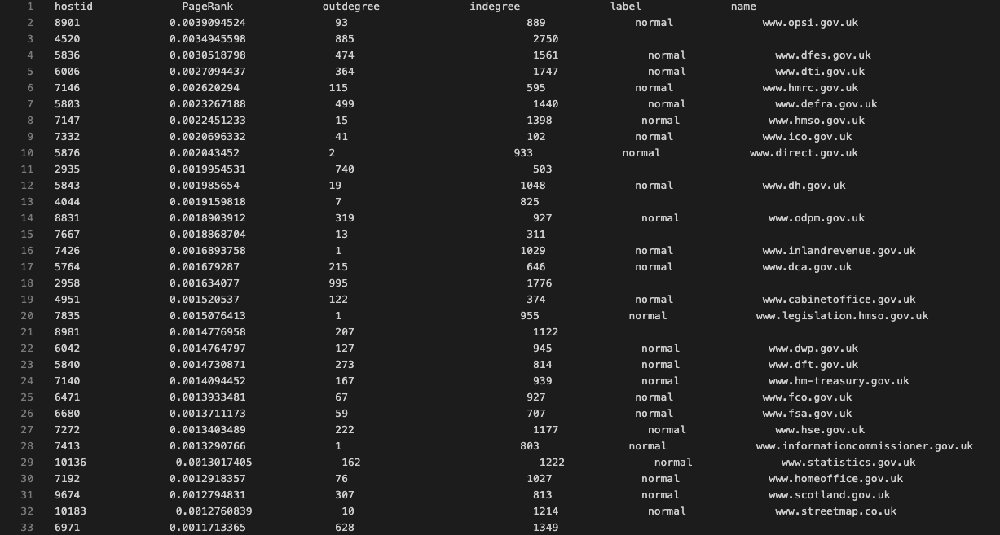

# PageRank-and-InversePageRank

### Project Description
Use PageRank algorithm and InversePageRank to get the PageRank value and InversePageRank value of each website, and sort them from largest to smallest. Then select the number of normal websites and spam websites in the first N websites, and display them visually

### File Description
- originalhostgraph_weighted.txt：Link structure between sites
- IdNameLabel.txt：Annotated files in the dataset
- inoutDegree.txt：Website in-degree and out-degree information
- StatsPageRank.txt：Comprehensive website information sorted by PageRank value
- StatsInversePageRank.txt：Comprehensive website information sorted by InversePageRank value

